# Neovim Configuration Wiki

Welcome to the documentation for this Neovim configuration. This wiki provides detailed information about the setup, plugins, and customizations.

## Overview

This Neovim configuration is organized into several categories:

- **Code**: Plugins for coding assistance, completion, and syntax
- **Editor**: General editor enhancements
- **Git**: Git integration tools
- **LSP**: Language Server Protocol setup
- **Search**: Search and navigation tools
- **Tmux**: Tmux integration
- **UI**: User interface enhancements

## Plugin Structure

```mermaid
graph TD
    A[Neovim Configuration] --> B[Code]
    A --> C[Editor]
    A --> D[Git]
    A --> E[LSP]
    A --> F[Search]
    A --> G[Tmux]
    A --> H[UI]
    
    B --> B1[nvim-surround]
    B --> B2[autoclose.nvim]
    B --> B3[Comment.nvim]
    B --> B4[nvim-cmp]
    B --> B5[mistake.nvim]
    B --> B6[tailwindcss]
    B --> B7[avante.nvim]
    B --> B8[copilot]
    
    C --> C1[symbols-outline]
    C --> C2[trouble.nvim]
    C --> C3[which-key.nvim]
    
    D --> D1[gitsigns.nvim]
    D --> D2[gitlinker.nvim]
    D --> D3[fugitive]
    D --> D4[lazygit.nvim]
    
    E --> E1[nvim-lspconfig]
    E --> E2[mason.nvim]
    E --> E3[none-ls.nvim]
    E --> E4[conform.nvim]
    E --> E5[treesitter]
    
    F --> F1[telescope.nvim]
    F --> F2[grug-far.nvim]
    
    G --> G1[nvim-tmux-navigation]
    
    H --> H1[lualine.nvim]
    H --> H2[neo-tree.nvim]
    H --> H3[noice.nvim]
    H --> H4[dracula.nvim]
    H --> H5[tokyonight.nvim]
    H --> H6[statuscol.nvim]
    H --> H7[barbar.nvim]
    H --> H8[dashboard]
```



## Quick Links

- [Code Plugins](./code.md)
- [Editor Plugins](./editor.md)
- [Git Plugins](./git.md)
- [LSP Setup](./lsp.md)
- [Search Tools](./search.md)
- [Tmux Integration](./tmux.md)
- [UI Enhancements](./ui.md)
- [Custom Functions](./customs.md)
- [Configuration](./config.md)

## Key Mappings

The configuration uses Space as the leader key and comma as the local leader key:

```lua
vim.g.mapleader = " "
vim.g.maplocalleader = ","
```

See each section for specific key mappings related to different functionality.

## Getting Started

To use this configuration:

1. Ensure you have Neovim 0.9+ installed
2. Clone this configuration to your Neovim config directory
3. Run Neovim and let the lazy.nvim plugin manager install all plugins
4. Install language servers using `:Mason`

## Contributing

Feel free to customize this configuration to suit your needs. The modular structure makes it easy to add, remove, or modify components.
